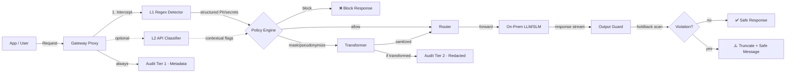

# Legit Flow — Architecture

## System Flow (Data Plane Pipeline)

## Component Descriptions

| Component | Package | Purpose |
|-----------|---------|---------|
| **Gateway Proxy** | `internal/gateway` | HTTP reverse proxy with streaming (SSE/chunked) support |
| **L1 Regex Detector** | `internal/detector` | Fast-path regex for VN PII (CCCD, SĐT, email, STK) + secrets (JWT, API keys) |
| **L2 API Classifier** | `internal/detector` | Pluggable LLM API (OpenAI/Anthropic/local) for contextual classification |
| **Policy Engine** | `internal/policy` | YAML-based policy-as-code with hot reload and versioning |
| **Transformer** | `internal/transformer` | Mask, pseudonymize, tokenize, block, or redact detected entities |
| **Output Guard** | `internal/outputguard` | Streaming holdback window — buffers N tokens, scans, truncates on violation |
| **Audit Logger** | `internal/audit` | 2-tier: Tier 1 metadata (always-on) + Tier 2 redacted content. Break-glass workflow. |
| **Tool Guard** | `internal/toolguard` | Allowlist + RBAC + approval for AI agent tool/action calls |

## Security Posture (Hardened-by-Default)

- **Non-root** container (UID 65534)
- **Read-only** root filesystem
- **Drop ALL** capabilities
- **Seccomp** RuntimeDefault profile
- **NetworkPolicy** deny-by-default
- **mTLS** ready (cert-manager hook)
- **No secrets in code** — all from K8s Secrets / env
