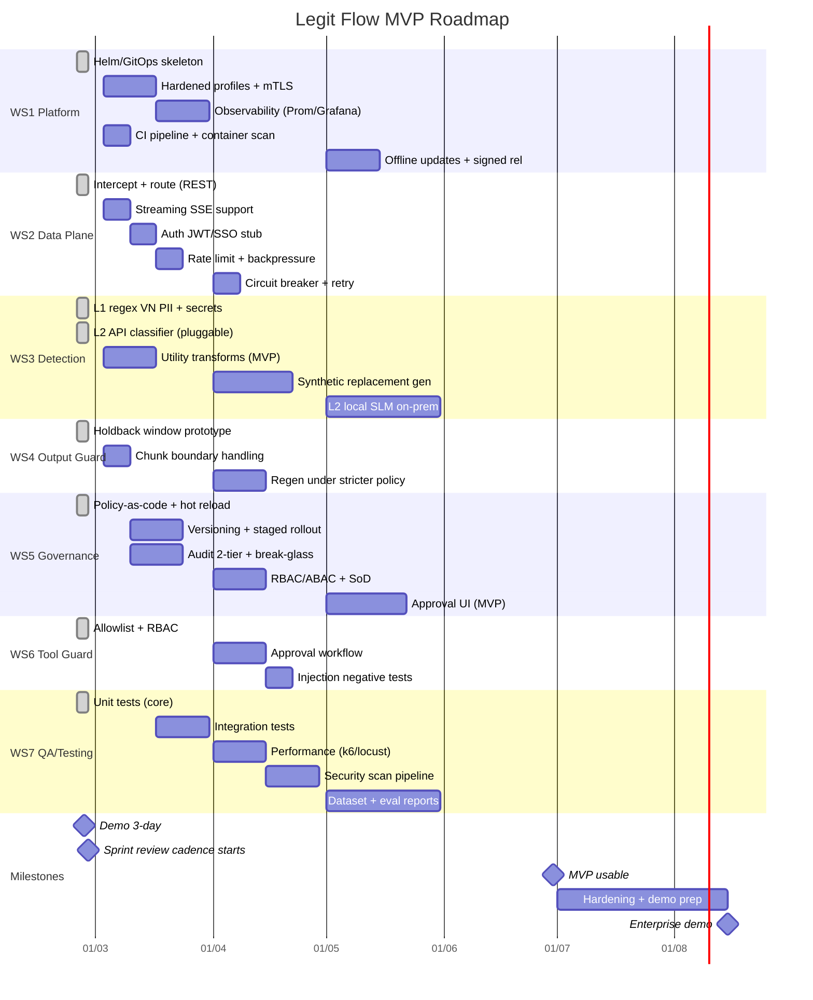

# Legit Flow — 4-Month Roadmap (24/02 → 30/06/2026)

## Workstream Owners (To Assign)

| WS | Focus | Suggested Owner |
|----|-------|-----------------|
| WS1 | Platform/DevOps | DevOps Lead |
| WS2 | Data Plane Core | Backend Lead |
| WS3 | Detection/Transform | Backend + ML |
| WS4 | Output Guard | Backend |
| WS5 | Governance/Audit | Backend + PM |
| WS6 | Tool Guard | Backend |
| WS7 | QA/Testing | QA + All |
